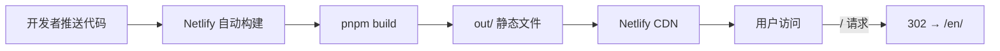
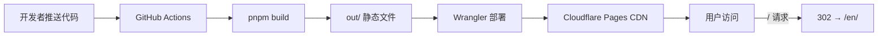

# 技术设计文档：Cloudflare 迁移

## 概述

本设计描述将 zingspark-landing-page 从 Netlify 迁移到 Cloudflare Pages 的技术方案。项目是一个 Next.js 16 静态导出站点（`output: "export"`），使用 pnpm 构建，通过 next-intl 支持中英文国际化。

迁移的核心工作包括：
1. 移除所有 Netlify 相关配置和文件
2. 添加 Cloudflare Pages 所需的 `_redirects` 和 `_headers` 配置文件
3. 创建 GitHub Actions 工作流实现自动部署
4. 确保现有功能（静态导出、国际化路由、GitHub Pages 文档部署）不受影响

由于项目使用纯静态导出模式，不涉及服务端渲染或 Cloudflare Workers，迁移方案相对直接。

## 架构

### 当前架构（Netlify）



- 构建触发：Netlify 自动检测 Git 推送
- 配置文件：`netlify.toml`（构建命令、重定向规则）
- 缓存头：由 Netlify 内部配置自动处理 `_next/static/*`

### 目标架构（Cloudflare Pages）



- 构建触发：GitHub Actions 监听 `main` 分支推送
- 配置文件：`public/_redirects`（重定向）、`public/_headers`（缓存头）
- 部署工具：`wrangler-action`（Cloudflare 官方 GitHub Action）

### 设计决策

| 决策 | 选择 | 理由 |
|------|------|------|
| 部署方式 | GitHub Actions + Wrangler | 比 Cloudflare 直连 Git 更灵活，可控制构建环境 |
| 配置文件位置 | `public/` 目录 | Next.js 静态导出会将 `public/` 内容复制到 `out/`，确保配置文件出现在构建产物中 |
| 重定向方式 | `_redirects` 文件 | Cloudflare Pages 原生支持，语法简洁，与 Netlify 的 `_redirects` 格式兼容 |
| 缓存策略 | `_headers` 文件 | Cloudflare Pages 原生支持，可精确控制路径级别的响应头 |

## 组件与接口

### 1. Cloudflare Pages 配置文件

#### `public/_redirects`

Cloudflare Pages 的重定向规则文件。Next.js 构建时会自动将 `public/` 目录内容复制到 `out/`。

```
/ /en/ 302
```

格式：`<源路径> <目标路径> <状态码>`

#### `public/_headers`

Cloudflare Pages 的 HTTP 响应头配置文件。

```
/_next/static/*
  Cache-Control: public, max-age=31536000, immutable
```

格式：路径匹配模式后跟缩进的响应头键值对。

### 2. GitHub Actions 工作流

#### `.github/workflows/deploy.yml`

工作流组件：

| 步骤 | 说明 |
|------|------|
| 触发条件 | `push` 到 `main` 分支 |
| 运行环境 | `ubuntu-latest` |
| Node.js | 使用与项目兼容的 LTS 版本（22.x） |
| pnpm | 通过 `corepack enable` 激活，版本由 `packageManager` 字段决定 |
| 依赖安装 | `pnpm install --frozen-lockfile` |
| 构建 | `pnpm build` |
| 部署 | `cloudflare/wrangler-action@v3`，指定 `out/` 为部署目录 |
| 认证 | `CLOUDFLARE_API_TOKEN` 和 `CLOUDFLARE_ACCOUNT_ID` 通过 GitHub Secrets 注入 |

### 3. 需要移除的文件

| 文件/目录 | 说明 |
|-----------|------|
| `netlify.toml` | Netlify 构建和重定向配置 |
| `.netlify/` | Netlify 本地状态和缓存目录 |

### 4. 需要修改的文件

| 文件 | 修改内容 |
|------|----------|
| `.gitignore` | 确认 `.netlify` 忽略规则保留；确认不会忽略 `_redirects`、`_headers` |

### 5. 不需要修改的文件

| 文件 | 理由 |
|------|------|
| `next.config.ts` | 静态导出配置已满足 Cloudflare Pages 要求 |
| `package.json` | 无 Netlify 相关依赖，`build` 和 `build:docs` 脚本无需变更 |
| `src/i18n/routing.ts` | 国际化路由配置与部署平台无关 |
| `scripts/copy-out-to-docs.mjs` | 文档构建脚本与部署平台无关 |

## 数据模型

本次迁移不涉及数据模型变更。项目是纯静态站点，无数据库或持久化存储。

涉及的配置数据结构：

### `_redirects` 文件格式

```
<源路径> <目标路径> <HTTP状态码>
```

每行一条规则，空格分隔。Cloudflare Pages 按从上到下的顺序匹配第一条命中的规则。

### `_headers` 文件格式

```
<路径匹配模式>
  <Header-Name>: <value>
```

路径支持 `*` 通配符。响应头行必须缩进（2个空格）。

### GitHub Actions 工作流 YAML 结构

```yaml
name: string
on:
  push:
    branches: [string]
jobs:
  deploy:
    runs-on: string
    steps: Step[]
```

关键 Secrets：
- `CLOUDFLARE_API_TOKEN`: Cloudflare API 令牌，需要 `Cloudflare Pages:Edit` 权限
- `CLOUDFLARE_ACCOUNT_ID`: Cloudflare 账户 ID


## 正确性属性

*属性是一种在系统所有有效执行中都应成立的特征或行为——本质上是关于系统应该做什么的形式化陈述。属性是人类可读规范与机器可验证正确性保证之间的桥梁。*

本次迁移是一个配置/部署任务，涉及的验收标准均为具体的文件存在性检查、配置内容验证和构建产物验证。这些都是具体的示例验证（example-based），而非适用于所有输入的通用属性（universal property）。

经过分析，所有验收标准均属于以下类别：
- **文件存在性检查**：验证特定文件是否存在或不存在
- **配置内容验证**：验证配置文件包含正确的规则
- **构建产物验证**：验证构建后输出目录包含预期文件
- **工作流结构验证**：验证 YAML 工作流文件包含正确的步骤和配置

由于本次迁移不涉及算法逻辑、数据转换或通用规则，没有适合属性基测试（property-based testing）的通用属性。所有验证均通过单元测试（示例测试）完成。

## 错误处理

### 构建阶段

| 错误场景 | 处理方式 |
|----------|----------|
| `pnpm install` 失败 | GitHub Actions 步骤失败，工作流终止，不会执行部署 |
| `pnpm build` 失败 | GitHub Actions 步骤失败，工作流终止，不会执行部署 |
| `out/` 目录不存在 | Wrangler 部署步骤报错，工作流失败 |

### 部署阶段

| 错误场景 | 处理方式 |
|----------|----------|
| `CLOUDFLARE_API_TOKEN` 未配置 | Wrangler 认证失败，部署终止 |
| `CLOUDFLARE_ACCOUNT_ID` 未配置 | Wrangler 无法定位账户，部署终止 |
| Cloudflare API 不可用 | Wrangler 部署失败，GitHub Actions 报告错误 |
| 项目名称不匹配 | Wrangler 报错，需要在 Cloudflare Dashboard 中先创建项目 |

### 运行时（Cloudflare Pages）

| 错误场景 | 处理方式 |
|----------|----------|
| `_redirects` 规则语法错误 | Cloudflare Pages 忽略错误规则，可能导致重定向失效 |
| `_headers` 规则语法错误 | Cloudflare Pages 忽略错误规则，缓存头不生效 |
| 404 页面 | Cloudflare Pages 自动提供默认 404 页面，或使用 `out/404.html`（如果存在） |

### 前置条件

部署前需要在 Cloudflare Dashboard 和 GitHub 仓库中完成以下手动配置：

1. **Cloudflare Dashboard**：创建 Cloudflare Pages 项目
2. **Cloudflare Dashboard**：创建 API Token（需要 `Cloudflare Pages:Edit` 权限）
3. **GitHub 仓库 Settings → Secrets**：添加 `CLOUDFLARE_API_TOKEN`
4. **GitHub 仓库 Settings → Secrets**：添加 `CLOUDFLARE_ACCOUNT_ID`

## 测试策略

### 测试方法

由于本次迁移是配置/部署任务，所有验收标准都是具体的示例验证，采用纯单元测试方案：

- **单元测试**：验证配置文件内容、文件存在性、构建产物正确性
- **属性基测试**：不适用（无通用属性）

### 单元测试计划

使用 Vitest 编写测试，验证迁移后的配置正确性：

#### 测试 1：Netlify 配置已移除（验证需求 1）
- 验证 `netlify.toml` 文件不存在
- 验证 `.netlify/` 目录不存在
- 验证 `package.json` 中不包含 "netlify" 相关依赖或脚本

#### 测试 2：_redirects 文件正确性（验证需求 2）
- 验证 `public/_redirects` 文件存在
- 验证文件包含 `/ /en/ 302` 重定向规则

#### 测试 3：_headers 文件正确性（验证需求 3）
- 验证 `public/_headers` 文件存在
- 验证文件包含 `/_next/static/*` 路径的 `Cache-Control: public, max-age=31536000, immutable` 规则

#### 测试 4：GitHub Actions 工作流正确性（验证需求 4）
- 验证 `.github/workflows/deploy.yml` 文件存在
- 验证触发条件为 `push` 到 `main` 分支
- 验证包含 `pnpm install` 和 `pnpm build` 步骤
- 验证使用 `cloudflare/wrangler-action` 进行部署
- 验证引用了 `CLOUDFLARE_API_TOKEN` 和 `CLOUDFLARE_ACCOUNT_ID` secrets

#### 测试 5：Next.js 配置保持不变（验证需求 5）
- 验证 `next.config.ts` 包含 `output: "export"`
- 验证包含 `trailingSlash: true`（非开发模式）
- 验证包含 `images.unoptimized: true`

#### 测试 6：GitHub Pages 文档兼容性（验证需求 6）
- 验证 `package.json` 中 `build:docs` 脚本存在
- 验证 `scripts/copy-out-to-docs.mjs` 文件存在

#### 测试 7：.gitignore 正确性（验证需求 7）
- 验证 `.gitignore` 包含 `.netlify` 忽略规则
- 验证 `.gitignore` 不包含对 `_redirects` 或 `_headers` 的忽略规则

### 手动验证清单

以下项目需要在实际部署后手动验证：

1. 推送代码到 `main` 分支后，GitHub Actions 工作流自动触发
2. 工作流成功完成构建和部署
3. 访问 Cloudflare Pages 域名，页面正常加载
4. 访问根路径 `/`，正确 302 重定向到 `/en/`
5. 中文页面 `/zh/` 正常访问
6. 静态资源响应头包含正确的 `Cache-Control`
7. `pnpm build:docs` 仍然正常工作
