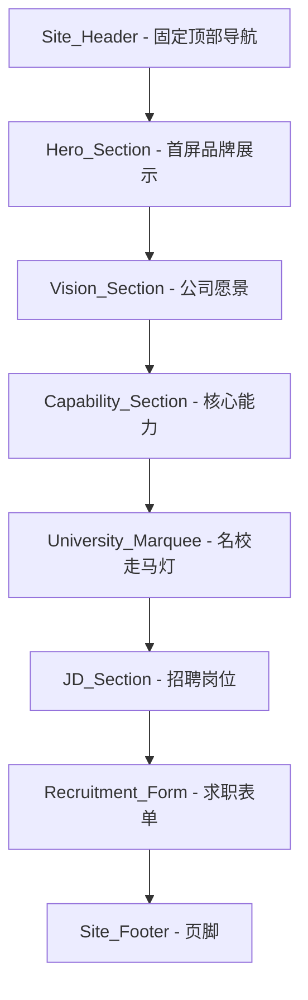
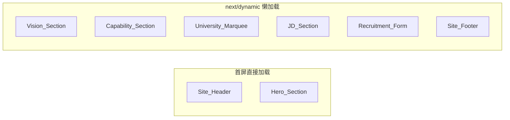
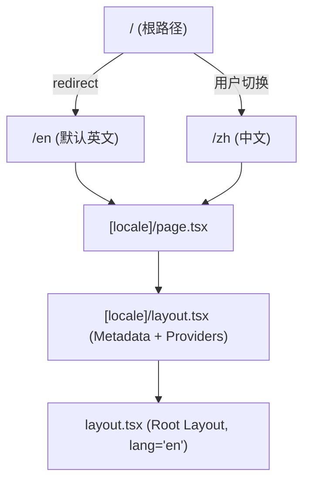

# 设计文档：星跃智启 Landing Page 全面重设计

## 概述

本设计文档描述星跃智启（Zingspark）Landing Page 的全面重设计方案。核心目标是将公司定位从泛 AI 研发更新为"原生 AI Agent 研发与跨领域场景落地"，同时新增多个页面区段、优化国际化配置、提升性能与 SEO。

现有技术栈保持不变：
- **框架**: Next.js 16 (App Router) + TypeScript
- **样式**: Tailwind CSS v4 + tw-animate-css
- **动画**: Motion (Framer Motion)
- **国际化**: next-intl (zh/en 双语)
- **主题**: next-themes (深色/浅色/系统)
- **代码质量**: Biome
- **部署**: Netlify 静态导出 (pnpm)

### 关键变更摘要

1. 新增 3 个页面区段：Vision_Section、Capability_Section、JD_Section
2. 默认语言从 `zh` 切换为 `en`，移除根路径语言选择中间页
3. 所有文案更新为 AI Agent 新定位
4. 非首屏组件使用 `next/dynamic` 懒加载
5. 联系邮箱从 `zingsparktech@gmail.com` 更新为 `hi@zingspark.tech`
6. 导航栏扩展为 6 个锚点链接
7. 岗位卡片点击联动表单的"感兴趣方向"字段

## 架构

### 页面区段布局

页面采用单页面垂直滚动布局，区段顺序如下：



### 加载策略



首屏关键组件（Site_Header、Hero_Section）直接 import，保证首屏渲染速度。其余组件通过 `next/dynamic` 配合 `ssr: false` 实现按需加载。

### 路由与国际化架构



**关键变更**：
- `src/i18n/routing.ts` 中 `defaultLocale` 从 `"zh"` 改为 `"en"`
- `src/app/page.tsx` 从语言选择中间页改为直接 redirect 至 `/en`
- `src/app/layout.tsx` 中 `lang` 属性从 `"zh"` 改为 `"en"`

## 组件与接口

### 组件层级结构

```
src/app/[locale]/page.tsx
├── SiteHeader (直接 import)
├── HeroSection (直接 import)
├── VisionSection (dynamic import) ← 新增
├── CapabilitySection (dynamic import) ← 新增
├── UniversityMarquee (dynamic import)
├── JDSection (dynamic import) ← 新增
├── RecruitmentSection (dynamic import)
└── SiteFooter (dynamic import)
```

### 新增组件设计

#### 1. VisionSection (`src/components/vision-section.tsx`)

- **职责**: 展示公司愿景"Empowering Paradigm Shifts with Native AI. 原生智能，跃迁未来"
- **HTML 锚点**: `id="vision"`
- **动画**: 使用 Motion 的 `whileInView` 实现滚动触发渐入动画，配置 `viewport: { once: true }`
- **内容**: 愿景标语 + "Frontier Lab" 定位描述
- **国际化**: 通过 `useTranslations("Vision")` 获取翻译文本

#### 2. CapabilitySection (`src/components/capability-section.tsx`)

- **职责**: 以三张卡片展示核心能力（框架解构、软硬件协同、全球化）
- **HTML 锚点**: `id="capabilities"`
- **动画**: 三张卡片使用 Motion 的 `staggerChildren` 实现交错渐入
- **数据源**: 能力卡片数据从 `site-config.ts` 的 `capabilities` 数组读取，或直接从 i18n messages 中获取
- **国际化**: 通过 `useTranslations("Capabilities")` 获取翻译文本

#### 3. JDSection (`src/components/jd-section.tsx`)

- **职责**: 以卡片网格展示 9 个招聘岗位，点击卡片联动 Recruitment_Form
- **HTML 锚点**: `id="jobs"`
- **交互**: 点击岗位卡片 → 高亮卡片 → 平滑滚动至 `#join` → 将岗位名称填入表单的"感兴趣方向"字段
- **跨组件通信**: 通过 URL hash 参数或自定义 DOM 事件 (`CustomEvent`) 将选中岗位传递给 RecruitmentSection
- **数据源**: 岗位列表从 `site-config.ts` 的 `jobs` 数组读取
- **国际化**: 通过 `useTranslations("Jobs")` 获取翻译文本

**跨组件通信方案**：

JDSection 点击岗位卡片时，dispatch 一个 `CustomEvent`：
```typescript
window.dispatchEvent(new CustomEvent("job-selected", { detail: { jobTitle } }));
```

RecruitmentSection 通过 `useEffect` 监听该事件，更新表单的 `interest` 字段：
```typescript
useEffect(() => {
  const handler = (e: CustomEvent) => {
    setFormData(prev => ({ ...prev, interest: e.detail.jobTitle }));
  };
  window.addEventListener("job-selected", handler);
  return () => window.removeEventListener("job-selected", handler);
}, []);
```

这种方案避免了引入全局状态管理库，保持组件解耦，且兼容 `next/dynamic` 懒加载。

### 现有组件修改

#### HeroSection (`src/components/hero-section.tsx`)

- 更新品牌标语和描述文案（通过 i18n messages 更新）
- CTA 按钮 href 保持 `#join`（滚动至 Recruitment_Form）
- 滚动指示器 href 从 `#team` 改为 `#vision`（指向下一个区段）
- 保留现有动画效果不变

#### SiteHeader (`src/components/site-header.tsx`)

- 导航链接从 3 个扩展为 6 个：关于我们(#about)、愿景(#vision)、能力(#capabilities)、团队(#team)、岗位(#jobs)、加入我们(#join)
- 保留主题切换和语言切换按钮
- 移动端汉堡菜单适配新增的导航项

#### RecruitmentSection (`src/components/recruitment-section.tsx`)

- mailto 目标邮箱从 `zingsparktech@gmail.com` 改为 `hi@zingspark.tech`（从 `siteConfig.email` 读取）
- 新增监听 `job-selected` 自定义事件，自动填充"感兴趣方向"字段
- 表单字段保持不变（姓名、邮箱、手机号、学校、学历、感兴趣方向、留言）

#### UniversityMarquee (`src/components/university-marquee.tsx`)

- 更新标题文案（通过 i18n messages 更新）
- 现有走马灯逻辑和渐变遮罩保持不变

#### SiteFooter (`src/components/site-footer.tsx`)

- 新增联系邮箱展示（mailto 链接）
- 更新版权信息文案
- 保留 ICP 备案号和公安备案号

#### JsonLd (`src/components/json-ld.tsx`)

- 更新 Organization schema 的 description 为 AI Agent 新定位
- email 从 `siteConfig.email` 读取（已更新为 `hi@zingspark.tech`）

### 页面入口修改 (`src/app/[locale]/page.tsx`)

```typescript
import SiteHeader from "@/components/site-header";
import { HeroSection } from "@/components/hero-section";
import dynamic from "next/dynamic";

const VisionSection = dynamic(() => import("@/components/vision-section").then(m => m.VisionSection), { ssr: false });
const CapabilitySection = dynamic(() => import("@/components/capability-section").then(m => m.CapabilitySection), { ssr: false });
const UniversityMarquee = dynamic(() => import("@/components/university-marquee").then(m => m.UniversityMarquee), { ssr: false });
const JDSection = dynamic(() => import("@/components/jd-section").then(m => m.JDSection), { ssr: false });
const RecruitmentSection = dynamic(() => import("@/components/recruitment-section").then(m => m.RecruitmentSection), { ssr: false });
const SiteFooter = dynamic(() => import("@/components/site-footer"), { ssr: false });

export default async function Home({ params }) {
  // ...
  return (
    <>
      <SiteHeader />
      <HeroSection />
      <VisionSection />
      <CapabilitySection />
      <UniversityMarquee />
      <JDSection />
      <RecruitmentSection />
      <SiteFooter />
    </>
  );
}
```

## 数据模型

### site-config.ts 扩展

```typescript
export const siteConfig = {
  // 现有字段保持不变...
  name: { zh: "星跃智启", en: "Zingspark" },
  fullName: { zh: "星跃智启（上海）科技有限公司", en: "Zingspark (Shanghai) Tech Co., Ltd." },
  url: "https://zingspark.tech",
  email: "hi@zingspark.tech",  // 更新
  offices: ["Beijing", "Shanghai", "Shenzhen"],
  // ...

  // 新增：岗位列表
  jobs: [
    { key: "agent-dev", name: { zh: "AI Agent 开发工程师", en: "AI Agent Developer" } },
    { key: "algorithm", name: { zh: "算法工程师", en: "Algorithm Engineer" } },
    { key: "architect", name: { zh: "软件架构师", en: "Software Architect" } },
    { key: "hardware", name: { zh: "硬件负责人", en: "Hardware Lead" } },
    { key: "qa", name: { zh: "测试工程师", en: "QA & Testing Engineer" } },
    { key: "pr", name: { zh: "全球公关", en: "Global PR" } },
    { key: "pm", name: { zh: "AI 产品经理", en: "AI PM" } },
    { key: "hr", name: { zh: "人才招聘", en: "Talent Acquisition" } },
    { key: "design", name: { zh: "UI/UX 设计师", en: "UI/UX Designer" } },
  ],

  // 现有字段
  universities: [ /* 保持不变 */ ],
} as const;
```

### i18n Messages 扩展

新增翻译键值命名空间：

```typescript
// messages/en.json 新增
{
  "Vision": {
    "tagline": "Empowering Paradigm Shifts with Native AI.",
    "subtitle": "Native Intelligence. Leaping into the Future.",
    "description": "As a Frontier Lab, Zingspark is dedicated to building universal agents that break the boundaries between the physical and digital worlds."
  },
  "Capabilities": {
    "title": "Core Competencies",
    "items": {
      "framework": {
        "title": "Deep Framework Deconstruction",
        "description": "Deep expertise in leading multi-agent frameworks like OpenClaw, MetaGPT, and CrawlAI. Active contributors to top-tier Agent open-source projects."
      },
      "hardware": {
        "title": "Software-Hardware Synergy",
        "description": "Capability to extend from digital systems to physical hardware ecosystems, developing Agents with real-world interaction abilities."
      },
      "global": {
        "title": "Global Reach",
        "description": "Professional English communication skills and a tech stack synchronized with the international frontier in real-time."
      }
    }
  },
  "Jobs": {
    "title": "Open Positions",
    "subtitle": "Find your role in shaping the future of AI Agents.",
    "clickHint": "Click a role to apply"
  },
  // Header 更新
  "Header": {
    "about": "About",
    "vision": "Vision",
    "capabilities": "Capabilities",
    "team": "Team",
    "jobs": "Positions",
    "join": "Join Us"
  }
}
```

### 表单数据模型

表单数据结构保持不变：

```typescript
interface RecruitmentFormData {
  name: string;       // 必填
  email: string;      // 必填
  phone: string;      // 选填
  school: string;     // 选填
  education: string;  // 下拉选择: bachelor | master | phd | other
  interest: string;   // 文本输入，可由 JD 卡片自动填充
  message: string;    // 选填
}
```

邮件主题格式：`[Zingspark Application] {姓名} — {学校}`


## 正确性属性

*正确性属性是指在系统所有有效执行中都应成立的特征或行为——本质上是关于系统应该做什么的形式化陈述。属性是人类可读规范与机器可验证正确性保证之间的桥梁。*

### 属性 1：大学展示完整性与本地化正确性

*对于任意* `siteConfig.universities` 中的大学和任意语言环境（zh/en），University_Marquee 渲染的大学名称应与该大学在对应语言环境下的 `name[locale]`（或 `name.abbr[locale]`，若存在）完全一致，且渲染的大学总数应等于配置中的大学数量（11 所）。

**验证: 需求 4.1, 4.4**

### 属性 2：岗位卡片点击事件正确传递

*对于任意* `siteConfig.jobs` 中的岗位，当用户点击该岗位卡片时，JDSection 应 dispatch 一个 `job-selected` CustomEvent，其 `detail.jobTitle` 应等于当前语言环境下该岗位的名称；RecruitmentSection 接收到该事件后，表单的 `interest` 字段值应更新为该岗位名称。

**验证: 需求 5.2**

### 属性 3：岗位数据双语完整性

*对于任意* `siteConfig.jobs` 中的岗位对象，其 `name.zh` 和 `name.en` 字段均应为非空字符串。

**验证: 需求 5.3**

### 属性 4：Mailto URL 构造正确性

*对于任意* 有效的表单数据（姓名非空、邮箱非空），生成的 mailto URL 应满足：(a) 目标邮箱为 `hi@zingspark.tech`，(b) 邮件主题遵循 `[Zingspark Application] {姓名} — {学校}` 格式，(c) 邮件正文包含所有已填写的表单字段。

**验证: 需求 6.2, 6.3**

### 属性 5：表单字段双语标签完整性

*对于任意* Recruitment_Form 中的表单字段和任意语言环境（zh/en），该字段的标签文本和占位符文本在对应的 i18n messages 中应为非空字符串。

**验证: 需求 6.4**

### 属性 6：新增区段翻译完整性

*对于任意* 新增组件使用的翻译键（Vision、Capabilities、Jobs 命名空间下的所有键），`messages/zh.json` 和 `messages/en.json` 中均应存在对应的非空字符串值。

**验证: 需求 9.3, 9.5**

### 属性 7：语义化 Section 元素与 ID 属性

*对于任意* 页面区段组件（Hero、Vision、Capabilities、University Marquee、JD、Recruitment），其渲染输出应包含一个 `<section>` HTML 元素，且该元素的 `id` 属性应与导航栏中对应的锚点链接 href 值一致（分别为 about、vision、capabilities、team、jobs、join）。

**验证: 需求 10.6**

### 属性 8：滚动动画单次触发配置

*对于任意* 使用 Motion `whileInView` 动画的组件，其 `viewport` 配置应包含 `once: true`，确保动画仅在元素首次进入视口时触发一次。

**验证: 需求 11.3**

## 错误处理

### 表单验证错误

- 必填字段（姓名、邮箱）未填写时，依赖浏览器原生 HTML5 表单验证（`required` 属性），阻止表单提交并显示浏览器默认提示
- 邮箱格式错误时，依赖 `type="email"` 的浏览器原生验证

### mailto 协议降级

- 如果用户设备未配置默认邮件客户端，`mailto:` 链接可能无法打开。当前方案不做额外降级处理，因为这是浏览器/操作系统层面的行为
- 表单数据通过 `encodeURIComponent` 编码，防止特殊字符破坏 mailto URL 结构

### 国际化回退

- 如果请求的 locale 不在支持列表中（`["zh", "en"]`），`src/i18n/request.ts` 会回退到 `defaultLocale`（"en"）
- 翻译键缺失时，next-intl 会显示键名作为回退文本

### 动态导入加载状态

- `next/dynamic` 配合 `ssr: false` 使用时，组件在客户端加载前不会渲染任何内容
- 由于首屏组件（Header + Hero）直接加载，用户不会看到空白页面
- 非首屏组件在用户滚动到达前通常已完成加载，无需显式 loading 状态

### 图片加载错误

- 大学 logo 使用 Next.js `Image` 组件，`unoptimized: true`（静态导出模式）
- 如果图片文件缺失，浏览器会显示 `alt` 文本作为降级

## 测试策略

### 双重测试方法

本项目采用单元测试与属性测试相结合的策略：

- **单元测试**: 验证具体示例、边界情况和错误条件
- **属性测试**: 验证跨所有输入的通用属性

两者互补，共同提供全面的测试覆盖。

### 属性测试配置

- **测试库**: 使用 [fast-check](https://github.com/dubzzz/fast-check) 作为 TypeScript 属性测试库
- **测试框架**: Playwright Test（项目已安装 `@playwright/test`）配合 fast-check
- **每个属性测试最少运行 100 次迭代**
- **每个属性测试必须通过注释引用设计文档中的属性编号**
- **标签格式**: `Feature: landing-page-redesign, Property {number}: {property_text}`
- **每个正确性属性由单个属性测试实现**

### 单元测试覆盖

单元测试聚焦于：
- 具体示例：验证特定组件渲染正确的内容（如 Hero 展示 logo、CTA 按钮指向 #join）
- 集成点：验证 JDSection 与 RecruitmentSection 的 CustomEvent 通信
- 边界情况：空表单提交、缺失翻译键、无效 locale 回退
- 配置正确性：siteConfig 包含所有必要字段、邮箱已更新

### 属性测试覆盖

属性测试聚焦于：
- 属性 1: 生成随机 locale，验证所有大学名称渲染正确
- 属性 2: 生成随机岗位索引，验证点击事件传递正确
- 属性 3: 遍历所有岗位，验证双语名称非空
- 属性 4: 生成随机姓名/学校/邮箱组合，验证 mailto URL 构造正确
- 属性 5: 遍历所有表单字段 × 两种 locale，验证标签非空
- 属性 6: 遍历所有新增翻译键 × 两种 locale，验证值非空
- 属性 7: 遍历所有区段组件，验证 section 元素和 id 属性
- 属性 8: 遍历所有动画组件，验证 viewport.once 配置
