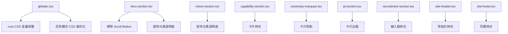

# 设计文档：亮色模式颜色优化与 Hero Section 按钮精简

## 概述

本设计文档描述对星跃智启 Landing Page 的两项优化：

1. **Hero Section 精简**：移除 "Scroll to explore" 辅助按钮，保留核心 CTA 和滚动指示器
2. **亮色模式颜色体系全面优化**：调整 CSS 自定义属性、装饰元素透明度、卡片/表单样式、导航栏/页脚样式、渐变/品牌色适配

当前亮色模式的核心问题：背景过白、边框几乎不可见、装饰元素透明度过低、卡片与背景融为一体。优化策略是在 `:root` 层面调整 CSS 变量，在组件层面通过 Tailwind 的 `dark:` 变体前缀确保仅影响亮色模式。

技术栈不变：Next.js 16 + TypeScript + Tailwind CSS v4 + Motion + next-intl + next-themes + Biome。

## 架构

### 设计决策

**决策 1：CSS 变量优先策略**
- 优先通过修改 `globals.css` 中 `:root` 下的 CSS 自定义属性实现全局颜色调整
- 理由：CSS 变量是整个颜色体系的单一真相源，修改变量可以级联影响所有使用该变量的组件，减少逐组件修改的工作量
- 仅在 CSS 变量无法覆盖的场景（如组件内硬编码的透明度值）才修改组件文件

**决策 2：dark: 变体隔离策略**
- 所有亮色模式优化通过 Tailwind 的条件类名实现，深色模式样式通过 `dark:` 前缀或 `.dark` CSS 选择器保持不变
- 理由：next-themes 通过在 `<html>` 上切换 `class="dark"` 来控制主题，Tailwind v4 的 `@custom-variant dark` 已配置为 `&:is(.dark *)`

**决策 3：oklch 色彩空间一致性**
- 所有新增或修改的颜色值统一使用 oklch 色彩空间
- 理由：现有 CSS 变量全部使用 oklch，保持一致性便于维护和色彩计算

### 修改范围

### 影响分析

| 文件 | 修改类型 | 涉及需求 |
|------|---------|---------|
| `src/app/globals.css` | CSS 变量 + CSS 类 | 需求 2, 3, 4, 6 |
| `src/components/hero-section.tsx` | 删除元素 + 透明度调整 | 需求 1, 3, 6 |
| `src/components/vision-section.tsx` | 透明度调整 | 需求 3, 6 |
| `src/components/capability-section.tsx` | 卡片样式 | 需求 4 |
| `src/components/university-marquee.tsx` | 卡片阴影 | 需求 4 |
| `src/components/jd-section.tsx` | 卡片边框 | 需求 4 |
| `src/components/recruitment-section.tsx` | 输入框样式 | 需求 4 |
| `src/components/site-header.tsx` | 导航栏样式 | 需求 5 |
| `src/components/site-footer.tsx` | 页脚样式 | 需求 5 |

## 组件与接口

### 1. globals.css — CSS 变量层

**`:root` 变量调整（亮色模式）：**

| 变量 | 当前值 | 优化值 | 说明 |
|------|--------|--------|------|
| `--background` | `oklch(0.985 0.002 247)` | `oklch(0.975 0.006 260)` | 微蓝紫色调暖灰白，增加视觉深度 |
| `--card` | `oklch(0.97 0.004 247)` | `oklch(0.99 0.003 260)` | 卡片略亮于背景，形成层次差 |
| `--muted-foreground` | `oklch(0.55 0.02 261)` | `oklch(0.45 0.03 261)` | 提升辅助文字对比度至 WCAG AA |
| `--border` | `oklch(0 0 0 / 8%)` | `oklch(0 0 0 / 15%)` | 边框更清晰可辨 |
| `--input` | `oklch(0 0 0 / 12%)` | `oklch(0 0 0 / 18%)` | 输入框边框更明显 |
| `--secondary` | `oklch(0.94 0.01 255)` | `oklch(0.92 0.015 260)` | 次要背景区域更明显 |
| `--muted` | `oklch(0.94 0.01 255)` | `oklch(0.92 0.015 260)` | 与 secondary 保持一致 |

**亮色模式 CSS 类调整：**

| 类名 | 调整内容 |
|------|---------|
| `.gradient-mesh` | 提升渐变透明度（0.15→0.22, 0.12→0.18, 0.1→0.15） |
| `.aurora-bg` | 提升 aurora 透明度（0.06→0.12） |
| `.glass-card` | 增加边框不透明度（0.06→0.12）、增加阴影 |
| `.glass-card-enhanced` | 增加边框不透明度（0.08→0.14）、增加阴影深度 |
| `.section-divider::before` | 提升亮色模式 opacity（0.5→0.7） |
| `.section-divider-glow::after` | 提升亮色模式 opacity（0.8→1.0） |

### 2. hero-section.tsx — Hero 区域

**移除 Scroll Button：**
- 删除 `<a href="#vision">` 元素及其包含的 `t("scrollDown")` 文本和 `Icons.chevronDown` 图标
- CTA 区域从 `flex-col` + `sm:flex-row` 简化为单按钮居中布局

**装饰元素透明度提升：**
- 发光球体：`opacity-[0.04]` → `opacity-[0.10]`（亮色），`dark:opacity-[0.08]` 不变
- 轨道环线：`border-primary/[0.07]` → `border-primary/[0.15]`（亮色），`dark:` 值不变
- 标题渐变 drop-shadow：增加亮色模式专用 drop-shadow 强度

### 3. vision-section.tsx — 愿景区域

**装饰元素透明度提升：**
- 浮动粒子：当前透明度值（0.40-0.60）在亮色模式下已可见，但背景光球需提升
- 背景光球：`bg-primary/[0.03]` → `bg-primary/[0.08]`（亮色），`dark:` 值不变
- 几何弧线：`border-primary/[0.08]` → `border-primary/[0.15]`（亮色），`dark:` 值不变
- 标语 drop-shadow：增加亮色模式 filter 强度

### 4. 卡片组件（capability-section, university-marquee, jd-section, recruitment-section）

**通用策略：**
- 在亮色模式下增加 `shadow-sm` 或 `shadow-md` 基础阴影
- 提升 `border-border/50` 至更高不透明度
- 通过 `dark:` 前缀保持深色模式不变

### 5. site-header.tsx — 导航栏

- 提升亮色模式背景不透明度：`bg-background/80` → `bg-background/90`
- 提升边框可见度：`border-border/30` → `border-border/50`（亮色模式）

### 6. site-footer.tsx — 页脚

- 提升顶部渐变分隔线的亮色模式可见度
- 优化文字颜色层次：公司名称保持 foreground，地址/邮箱从 `/70` 提升至 `/80`

## 数据模型

本次优化不涉及数据模型变更。所有修改均为 CSS 样式和 JSX 结构调整，不涉及状态管理、API 接口或数据持久化。

## 正确性属性（Correctness Properties）

*属性（Property）是一种在系统所有有效执行中都应成立的特征或行为——本质上是关于系统应该做什么的形式化陈述。属性是人类可读规范与机器可验证正确性保证之间的桥梁。*

### Property 1: 深色模式样式不变性

*For all* CSS 自定义属性和组件样式中带有 `.dark` 选择器或 `dark:` 前缀的值，优化后的值应与优化前完全一致。即：对于 globals.css 中 `.dark` 块内的每一个 CSS 变量，以及每个组件中每一个 `dark:` 前缀的 Tailwind 类名，其值在修改前后不应发生任何变化。

**Validates: Requirements 2.6, 3.6, 4.6, 5.5, 6.5, 7.4**

### Property 2: 辅助文字 WCAG AA 对比度

*For any* 亮色模式下的 `--muted-foreground` 与 `--background` 颜色组合，计算两者的 WCAG 对比度比值应 >= 4.5:1。即：将 oklch 值转换为相对亮度后，`(L_lighter + 0.05) / (L_darker + 0.05) >= 4.5`。

**Validates: Requirements 2.3**

### Property 3: oklch 色彩空间一致性

*For all* globals.css 中 `:root` 和 `.dark` 选择器下的颜色类 CSS 变量值（排除使用 `oklch(... / N%)` 透明度语法的 `--border` 和 `--input`），每个值都应使用 `oklch(...)` 格式。即：对于每个颜色变量，其值应匹配正则表达式 `^oklch\(.+\)$`。

**Validates: Requirements 7.5**

## 错误处理

本次优化为纯前端样式调整，不涉及运行时错误处理逻辑。主要风险和应对：

| 风险 | 应对策略 |
|------|---------|
| CSS 变量值格式错误导致样式失效 | 使用 oklch 格式并通过构建验证 |
| Tailwind 类名拼写错误 | Biome lint + TypeScript 类型检查 |
| 深色模式样式意外被修改 | Property 1 验证 + 手动视觉对比 |
| 移除 Scroll Button 后布局错位 | 构建验证 + 浏览器手动测试 |
| 颜色对比度不满足无障碍标准 | Property 2 验证 WCAG AA |

## 测试策略

### 双重测试方法

本项目采用单元测试 + 属性测试的双重策略：

**单元测试（Unit Tests）：**
- 验证 Hero Section 中 Scroll Button 已被移除（DOM 不包含 `href="#vision"` 的辅助按钮）
- 验证 Hero Section 滚动指示器仍然存在
- 验证 i18n 语言包中 `Hero.scrollDown` 键值仍然存在
- 验证各组件亮色模式样式值已更新（透明度、边框、阴影等）
- 验证 CSS 变量值已按设计调整
- 验证构建成功（`pnpm build`、`pnpm lint`、`pnpm typecheck`）

**属性测试（Property-Based Tests）：**
- 使用 `fast-check` 库（TypeScript 生态中成熟的 PBT 库）
- 每个属性测试至少运行 100 次迭代
- 每个测试用注释标注对应的设计属性：`Feature: light-mode-color-polish, Property {number}: {property_text}`

**属性测试实现：**

1. **Property 1 — 深色模式样式不变性**：解析 globals.css 中 `.dark` 块的所有 CSS 变量，与预存的基线快照对比。对于组件文件，提取所有 `dark:` 前缀的类名，验证与基线一致。生成随机的 CSS 变量名子集进行抽样验证。

2. **Property 2 — WCAG AA 对比度**：生成随机的 oklch 颜色对（在合理范围内），验证对比度计算函数的正确性。然后用实际的 `--muted-foreground` 和 `--background` 值验证对比度 >= 4.5。

3. **Property 3 — oklch 色彩空间一致性**：解析 CSS 文件，提取所有颜色变量值，验证每个值匹配 oklch 格式。生成随机的 CSS 变量名，验证解析逻辑的鲁棒性。
