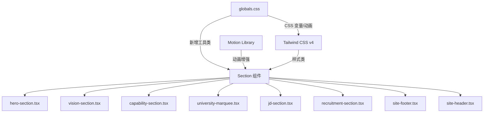

# 设计文档：星跃智启 Landing Page 视觉美化与极致优化

## 概述

本设计文档描述对 Zingspark Landing Page 进行全面视觉美化升级的技术方案。在保持现有页面结构、功能逻辑和技术栈不变的前提下，通过 CSS 增强、Motion 动画优化、组件样式升级等手段，将视觉品质提升至顶级 AI 公司官网水准。

核心设计原则：
- **纯视觉层优化**：不改变组件的数据流、状态管理或业务逻辑
- **CSS 优先**：装饰性元素尽量使用纯 CSS（渐变、伪元素、动画），减少 JS 运行时开销
- **GPU 加速**：所有动画仅使用 `transform` 和 `opacity`，避免布局重排
- **主题一致**：所有视觉增强同时适配深色/浅色模式
- **响应式适配**：移动端适当缩减装饰元素，保证内容可读性
- **无障碍**：尊重 `prefers-reduced-motion`，确保对比度达标

## 架构

本次优化不引入新的架构层级或依赖。所有改动在现有架构内完成：



改动范围：
1. `src/app/globals.css` — 新增可复用 CSS 工具类、动画关键帧、区段过渡样式
2. `src/components/*.tsx` — 各区段组件的样式类和 Motion 动画参数调整
3. `src/components/icons.tsx` — 新增 JD Section 所需的 SVG 线条图标

不涉及的文件：
- 路由、布局、i18n 配置、站点配置等均不修改
- 不新增任何 npm 依赖

## 组件与接口

### 1. globals.css 新增工具类

```css
/* 区段过渡分隔器 */
.section-divider { /* 渐变线 + 光点装饰 */ }
.section-divider-glow { /* 发光型分隔 */ }

/* 增强型玻璃卡片 */
.glass-card-enhanced { /* 更精致的毛玻璃 + 内发光 */ }

/* 渐变边框动画（用于 focus 状态） */
.gradient-border-focus { /* 输入框焦点渐变边框 */ }

/* 浮动粒子动画 */
@keyframes float-particle { /* 粒子浮动 */ }

/* 脉冲光效（选中状态） */
@keyframes pulse-glow { /* 脉冲发光 */ }

/* prefers-reduced-motion 全局处理 */
@media (prefers-reduced-motion: reduce) {
  *, *::before, *::after {
    animation-duration: 0.01ms !important;
    transition-duration: 0.01ms !important;
  }
}
```

### 2. 区段过渡方案

每对相邻区段之间通过 CSS 伪元素或额外的 `<div>` 实现过渡：

| 过渡位置 | 实现方式 |
|---------|---------|
| Hero → Vision | 渐变背景色过渡（Hero section 底部 `::after` 伪元素） |
| Vision → Capability | 装饰性渐变线条 + 两侧光点 |
| Capability → University | 渐变淡出过渡带 |
| JD → Recruitment | 视觉引导箭头/渐变连接线 |
| Recruitment → Footer | 渐变分隔线 |

### 3. 组件样式增强接口

各组件的改动均为样式层面，不改变 props 接口：

- **VisionSection**: 新增浮动粒子 `<div>` 元素（`pointer-events: none`），增强文字 `text-shadow`
- **CapabilitySection**: 卡片顶部渐变色条、hover 增强（`translateY(-8px)` + 边框发光）、图标光晕
- **UniversityMarquee**: logo 卡片 hover 光晕、标题两侧装饰线、优化渐变遮罩宽度
- **JDSection**: emoji → SVG 图标映射、卡片渐变角标、选中脉冲光效
- **RecruitmentSection**: 表单卡片增强毛玻璃、输入框渐变 focus 边框、按钮 hover 增强
- **SiteHeader**: 滚动透明度渐变（需 `useScroll`）、活跃导航指示器
- **SiteFooter**: 顶部渐变分隔线、hover 光效、背景装饰

### 4. JD Section 图标映射

将 emoji 替换为统一风格的 SVG 线条图标：

```typescript
const jobIcons: Record<string, React.ReactNode> = {
  "agent-dev": <AgentIcon />,    // 机器人线条图标
  "algorithm": <BrainIcon />,     // 大脑/神经网络图标
  "architect": <ArchitectIcon />, // 架构图标
  "hardware": <ChipIcon />,       // 芯片图标
  "qa": <SearchIcon />,           // 搜索/测试图标
  "pr": <GlobeIcon />,            // 地球图标
  "pm": <ClipboardIcon />,        // 剪贴板图标
  "hr": <UsersIcon />,            // 人物图标
  "design": <PaletteIcon />,      // 调色板图标
};
```

每个图标使用对应的渐变色填充，与品牌色系保持一致。

## 数据模型

本次优化不涉及数据模型变更。所有改动均为视觉层面：

- 不修改 `siteConfig` 数据结构
- 不修改 i18n 消息文件（`messages/zh.json`、`messages/en.json`）
- 不修改组件的 state 或 props 类型
- 唯一的"数据"变更是 `jd-section.tsx` 中 `jobIcons` 从 `Record<string, string>`（emoji）变为 `Record<string, React.ReactNode>`（SVG 组件）

SiteHeader 新增一个 `useScroll` hook 来驱动滚动透明度，这是一个纯 UI 状态，不属于业务数据模型。


## 正确性属性（Correctness Properties）

*属性（Property）是指在系统所有合法执行中都应成立的特征或行为——本质上是对系统应做什么的形式化陈述。属性是人类可读规格说明与机器可验证正确性保证之间的桥梁。*

由于本次优化主要涉及视觉/样式层面，大量验收标准（如"视觉协调"、"hover 效果"、"装饰元素"）属于主观审美判断，无法通过自动化属性测试验证。以下属性聚焦于可程序化验证的结构性、一致性和无障碍性要求。

### Property 1: 岗位图标类型一致性

*对于任意* `siteConfig.jobs` 中的岗位 key，`jobIcons` 映射应返回一个 React 元素（SVG 组件），而非字符串（emoji）。

**Validates: Requirements 5.1**

### Property 2: 移动端装饰元素响应式隐藏

*对于任意* 新增的纯装饰性元素（粒子、光弧、几何线条），其 CSS 类中应包含响应式断点修饰符（如 `hidden md:block` 或 `opacity-0 md:opacity-100`），确保在小屏幕上不影响内容可读性。

**Validates: Requirements 2.6**

### Property 3: 交互元素过渡时长一致性

*对于任意* 可交互元素（按钮、链接、卡片、输入框）的 hover/focus 过渡效果，其 `transition-duration` 值应在 150ms 至 300ms 范围内。

**Validates: Requirements 6.5, 7.1**

### Property 4: 动画仅使用 GPU 加速属性

*对于任意* `@keyframes` 定义和 CSS transition 声明，被动画化的属性应仅限于 `transform` 和 `opacity`，不应包含会触发布局重排的属性（如 `width`、`height`、`top`、`left`、`margin`、`padding`）。

**Validates: Requirements 7.6, 10.1**

### Property 5: 装饰元素不阻塞交互

*对于任意* 纯装饰性覆盖元素（粒子、光晕、渐变遮罩、背景装饰），其样式中应包含 `pointer-events: none`（通过 CSS 类 `pointer-events-none` 或内联样式），确保不干扰用户的正常点击和交互。

**Validates: Requirements 10.2**

### Property 6: 设计系统一致性

*对于任意* 区段组件中的 section badge 元素，其 CSS 类应遵循统一模式：圆角（`rounded-full`）、边框（`border border-border/50`）、背景（`bg-card/40`）、字体（`text-xs uppercase tracking-widest`）。*对于任意* 区段标题（h2），字体大小应使用统一层级（`text-4xl md:text-6xl` 或 `text-3xl md:text-4xl`）。*对于任意* 卡片组件，圆角半径应使用统一值（`rounded-2xl` 或 `rounded-xl`）。

**Validates: Requirements 9.1, 9.2, 9.3**

### Property 7: 品牌渐变色一致性

*对于任意* 使用品牌渐变色的元素，其颜色值应使用规范的品牌色系：`#4893FC`（蓝）、`#969DFF`（中间紫蓝）、`#BD99FE`（紫），不应出现偏离品牌色系的渐变色值。

**Validates: Requirements 9.4**

### Property 8: WCAG AA 对比度达标

*对于任意* 正文文字颜色与其背景色的组合，对比度应 ≥ 4.5:1；*对于任意* 大文字（≥ 18pt 或 ≥ 14pt 加粗）与其背景色的组合，对比度应 ≥ 3:1。

**Validates: Requirements 9.6**

## 错误处理

本次视觉优化不涉及业务逻辑错误处理的变更。需要关注的错误场景：

### CSS 兼容性降级
- **场景**：`backdrop-filter`、`oklch()` 等现代 CSS 特性在旧浏览器中不支持
- **处理**：使用 `@supports` 查询提供降级方案，确保核心内容在不支持的浏览器中仍可正常显示
- **影响范围**：毛玻璃效果、颜色系统

### 动画性能降级
- **场景**：低性能设备上动画卡顿
- **处理**：通过 `prefers-reduced-motion: reduce` 媒体查询禁用非必要动画；所有动画仅使用 `transform`/`opacity` 确保 GPU 加速
- **影响范围**：浮动粒子、轨道旋转、走马灯

### SVG 图标加载
- **场景**：JD Section 的 SVG 图标渲染失败
- **处理**：图标作为内联 SVG 组件实现（非外部文件），不存在网络加载失败的风险
- **影响范围**：jd-section.tsx

### 主题切换闪烁
- **场景**：深色/浅色模式切换时新增装饰元素出现闪烁
- **处理**：所有主题相关样式通过 CSS 变量和 `.dark` 选择器实现，与 next-themes 的 `class` 策略一致
- **影响范围**：所有组件

## 测试策略

### 双重测试方法

本项目采用单元测试 + 属性测试的双重策略：

#### 属性测试（Property-Based Testing）

- **库选择**：`fast-check`（TypeScript 生态最成熟的 PBT 库）
- **最低迭代次数**：每个属性测试至少 100 次迭代
- **标签格式**：`Feature: visual-polish, Property {N}: {property_text}`
- **每个正确性属性对应一个属性测试**

属性测试重点：
- Property 1: 生成随机 job key，验证 `jobIcons[key]` 返回 React 元素
- Property 3: 扫描组件源码中的 `transition-duration` / `duration-` 类，验证值在 150-300ms 范围
- Property 4: 解析 globals.css 中的 `@keyframes` 定义，验证仅使用 `transform`/`opacity`
- Property 5: 扫描组件中的装饰性元素，验证包含 `pointer-events-none`
- Property 6: 扫描所有 section badge 的 CSS 类，验证一致性
- Property 7: 扫描所有渐变声明，验证颜色值属于品牌色系
- Property 8: 从 CSS 变量中提取颜色值，计算对比度

#### 单元测试

- **库选择**：Playwright（项目已安装 `@playwright/test`）
- **重点覆盖**：
  - 具体示例：`prefers-reduced-motion` 媒体查询存在性验证
  - 具体示例：区段过渡元素使用纯 CSS（无 JS 动画驱动）
  - 具体示例：`pnpm lint` 通过
  - 具体示例：`pnpm typecheck` 通过
  - 具体示例：`pnpm build` 成功且生成 /zh、/en HTML
  - 具体示例：globals.css 中定义了可复用工具类（`section-divider`、`glass-card-enhanced` 等）
  - 边缘情况：移动端视口下装饰元素的可见性

#### 测试配置

```typescript
// fast-check 属性测试示例
import fc from "fast-check";

// Feature: visual-polish, Property 1: 岗位图标类型一致性
test("all job icons are React elements, not emoji strings", () => {
  const jobKeys = siteConfig.jobs.map(j => j.key);
  fc.assert(
    fc.property(
      fc.constantFrom(...jobKeys),
      (key) => {
        const icon = jobIcons[key];
        return typeof icon !== "string" && React.isValidElement(icon);
      }
    ),
    { numRuns: 100 }
  );
});
```

注意：由于本项目当前未安装 `fast-check`，实施任务中需先添加该开发依赖。如团队偏好不引入新依赖，可使用 Playwright 的参数化测试替代属性测试。
